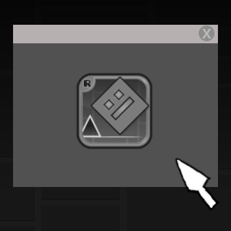

# Webview
<div align="center">
	
	<p align="center">Adding webview support to Geometry Dash.</p>
</div>

# Table Of Contents
* [Dependencies](#dependencies)
* [Warning](#warning)
* [How to use](#how-to-use)
* [Questions & Answers](#questions--answers)

# Dependencies
- Lexbor (HTML, CSS Parser)
- QuickJS (JavaScript Interpreter)

These are automatically installed thanks to the `FetchContent` function (on `CMakeLists.txt`)

# Warning
This is not the kind of Webview you'd expect, It instead shows content by converting all HTML tags into Cocos2D objects (CCMenu* etc.), And converting CSS (Stylesheets) into Cocos2D functions (duhhhh).

# How to use
TODO: Show how to install the API first
### Loading an HTML string
```c++
CCMenu* webview = zwk::WebView::create("<html><body><div>Hello World!</div></body></html>");
```

### Loading an HTML resource
```c++
CCMenu* webview = zwk::WebView::createFromResource("index.html");
```

# Questions & Answers
1. What does zwk mean and why is it a namespace?<br/>
**->** zwk means "zwstreak" which is the creator of this mod, I have decided to make it a namespace
   so that it holds all the APIs I make for Geometry Dash.

1. Why is the logo so bad?<br/>
**->** uhhhh i think that is because i am the only developer of this mod lol (i tried (kinda))